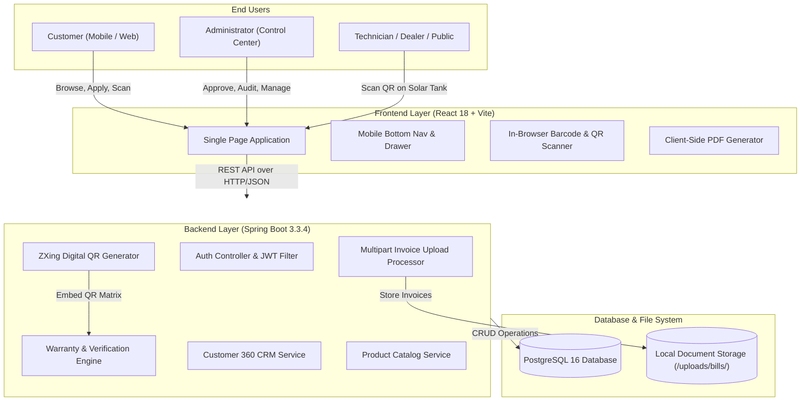
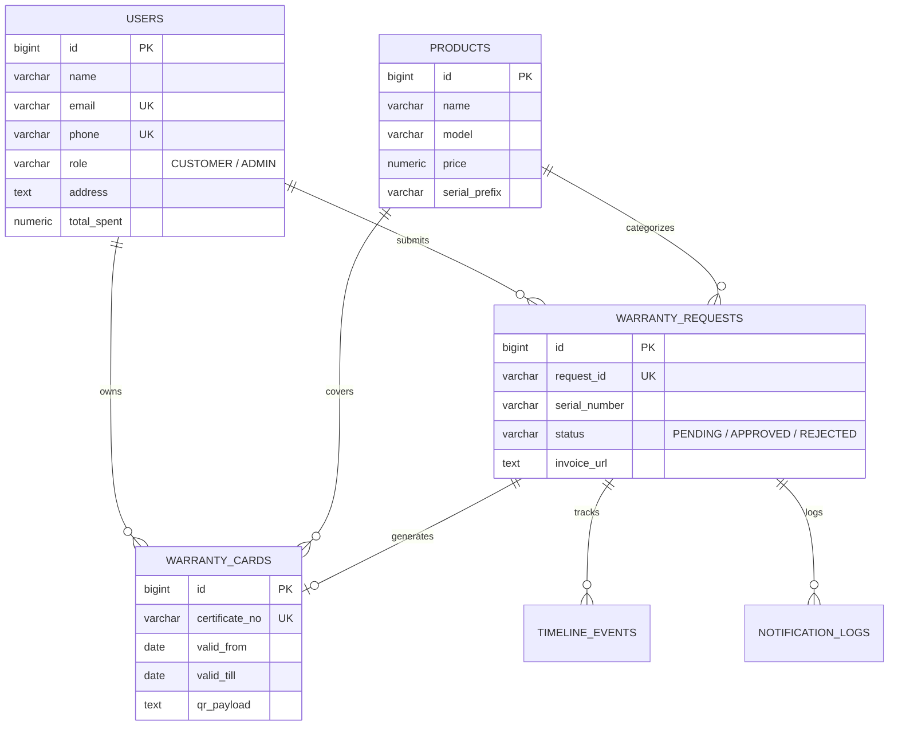

# Orange Solar E-Warranty Generation & Verification System

[](https://spring.io/projects/spring-boot)
[](https://reactjs.org/)
[](https://vitejs.dev/)
[](https://www.postgresql.org/)
[](https://tailwindcss.com/)
[](https://openjdk.org/)
[](https://www.docker.com/)

An enterprise-grade, cloud-ready digital warranty issuance and public verification platform custom engineered for **Sun Zone Solar System India Pvt. Ltd. (Orange Solar)**. 

This platform eliminates paper-based warranty slips and unauthorized warranty claims by replacing them with cryptographically verified digital warranty certificates, automated equipment serial validation, instant QR-code mobile verification, a 3-way customer notification ledger (WhatsApp, SMS, Email), and comprehensive Customer 360 intelligence.

---

## 📑 Table of Contents
1. [Executive Overview](#-executive-overview)
2. [Key Capabilities & Features](#-key-capabilities--features)
3. [System Architecture & Data Flow](#-system-architecture--data-flow)
4. [Technology Stack](#-technology-stack)
5. [Project Directory Structure](#-project-directory-structure)
6. [Database Schema & ERD](#-database-schema--erd)
7. [Security & Authentication Architecture](#-security--authentication-architecture)
8. [Getting Started & Local Setup](#-getting-started--local-setup)
   - [Prerequisites](#prerequisites)
   - [Quick Launch with Batch Script](#option-a-one-click-launch-windows)
   - [Manual Setup (Step-by-Step)](#option-b-manual-step-by-step-setup)
   - [Docker Compose Deployment](#option-c-docker-compose-production)
9. [Default System Credentials](#-default-system-credentials)
10. [REST API Endpoints Reference](#-rest-api-endpoints-reference)
11. [Technical Documentation](#-technical-documentation)
12. [License & Attribution](#-license--attribution)

---

## ☀️ Executive Overview

Solar water heaters, rooftop solar plants, and thermal heat pumps are long-term capital investments that require 5 to 10+ years of warranty assurance. Traditional paper warranty slips face severe challenges:
- Customers misplace paper bills and warranty cards over 5–10 years.
- Unauthorized or counterfeit solar systems attempt to claim manufacturer warranty.
- Dealers lack a unified mechanism to check installed serial numbers and validity dates.
- Administrators lack visibility into customer equipment portfolios, lifetime value, and pending claims.

**Orange Solar E-Warranty Platform** solves this by providing:
- **Zero-Friction Customer Experience**: Register warranties in under 60 seconds by scanning the product barcode or QR code with a phone camera, uploading the purchase invoice, and getting an instant digital certificate.
- **Mobile-First Responsiveness**: Complete thumb-friendly navigation with an elevated mobile bottom navigation bar and mobile drawer for all customer and admin screens.
- **Public Trust & Verification**: Anyone (dealers, technicians, customers) can scan the QR code on a solar water heater and instantly verify official manufacturer coverage on [`/verify/{certificateNo}`](http://localhost:5173/verify/EW-2024-8841).
- **Customer 360 & CRM Ledger**: Administrators have complete visibility into every customer's personal details, installed rooftop systems, active warranties, and proof documents in an inline accordion ledger.

---

## 🚀 Key Capabilities & Features

### 1. Customer Experience Portal
- **Interactive Dashboard**: Real-time counters for Total Requests, Approved Certifications, Pending Reviews, and Rejections.
- **Product Catalog**: Certified Orange Solar products categorized into *Solar Water Heater (ETC)*, *Solar Water Heater (FPC)*, *Heat Pumps*, and *Solar Rooftop Systems*.
- **Mobile-Friendly Warranty Application**:
  - In-browser live camera QR / barcode scanner (`html5-qrcode`).
  - Auto-fills product name, model, serial prefix, and dealer details from QR matrix.
  - Direct camera capture or file upload for purchase invoices/bills.
- **Digital E-Warranty Vault**:
  - Interactive certificate cards with tamper-proof holographic badge.
  - Dynamic QR code generated with embedded cryptographic verification payload.
  - One-click **PDF Certificate Download** powered by `jsPDF` and `html2canvas`.
- **Customer Profile**: View personal information, demographics, rooftop installation address, and registered solar systems.

### 2. Admin Operations & Control Center
- **Incoming Claims Queue**: Review incoming applications with purchase invoices, equipment serial numbers, and dealer verification.
- **Single-Click Approval / Rejection Engine**:
  - Configurable warranty duration (1 Year, 3 Years, 5 Years, 7 Years, 10 Years).
  - Cryptographically generated certificate number (e.g. `EW-2024-8841`).
  - Structured rejection reasons with feedback sent directly to customer.
- **Customer 360 & Purchase Ledger**:
  - Minimal, high-density table showing Customer, Phone, Warranty Status, and Lifetime Spend.
  - Inline accordion expansion: reveals complete customer profile, equipment bought, warranty certificates, and proof documents without leaving the page.
- **Product Management**: Add, update, and manage products with high-resolution photos and default warranty durations.
- **3-Way Multi-Channel Notification Audit**: Real-time logging of customer dispatches across WhatsApp, SMS, and Email.

### 3. Public Verification Portal
- Fully public URL (`/verify/:certificateNo`) requiring no login.
- Displays registered owner, equipment specifications, serial number match, dealer name, and exact expiration date with active coverage badge.

---

## 🏛️ System Architecture & Data Flow



---

## 💻 Technology Stack

### Backend Architecture
- **Language**: Java 17 (OpenJDK)
- **Framework**: Spring Boot 3.3.4
- **ORM / Persistence**: Spring Data JPA / Hibernate
- **Database Driver**: PostgreSQL JDBC Driver (`org.postgresql:postgresql`)
- **Security / Tokens**: Java JWT (`io.jsonwebtoken:jjwt-api:0.12.6`)
- **QR Code Matrix Generator**: Google ZXing (`com.google.zxing:core:3.5.3`, `com.google.zxing:javase:3.5.3`)
- **Build Tool**: Apache Maven 3.9.6

### Frontend Architecture
- **Framework**: React 18.3.1
- **Tooling & Dev Server**: Vite 5.4.6
- **Routing**: React Router DOM 6.26.2
- **CSS Framework**: Tailwind CSS 3.4.11 + Autoprefixer + PostCSS
- **Icons**: Lucide React 0.441.0
- **Barcode & QR Scanning**: `html5-qrcode` 2.3.8
- **QR Code Rendering**: `qrcode` 1.5.4
- **PDF Generation**: `jspdf` 2.5.2 + `html2canvas` 1.4.1
- **HTTP Client**: Axios 1.7.7 with automatic JWT Bearer token interceptor

---

## 📁 Project Directory Structure

```plaintext
orange-solar/
├── backend/                               # Spring Boot 3 Java Application
│   ├── pom.xml                            # Maven dependencies & build config
│   ├── Dockerfile                         # Backend container specification
│   ├── uploads/                           # Uploaded purchase invoices & bills
│   └── src/
│       ├── main/
│       │   ├── java/com/ewarranty/
│       │   │   ├── EWarrantyApplication.java   # Spring Boot entry point
│       │   │   ├── config/                     # CORS, WebMVC, Auto-provisioning
│       │   │   ├── controller/                 # REST API Controllers
│       │   │   ├── dto/                        # Data Transfer Objects (Requests/Responses)
│       │   │   ├── entity/                     # JPA Hibernate Entity Models
│       │   │   ├── init/                       # Seed data & account initializer
│       │   │   ├── repository/                 # Spring Data JPA Repositories
│       │   │   ├── service/                    # Business Logic Services
│       │   │   └── util/                       # JWT utilities & Token helpers
│       │   └── resources/
│       │       └── application.properties      # PostgreSQL DB, ports & upload configs
│       └── test/                               # JUnit & Spring Boot test suite
│
├── frontend/                              # React 18 + Vite Frontend Application
│   ├── package.json                       # NPM dependencies & build scripts
│   ├── vite.config.js                     # Vite build & backend API proxy configuration
│   ├── tailwind.config.js                 # Tailwind CSS theme & font configuration
│   ├── Dockerfile                         # Frontend container specification
│   ├── index.html                         # HTML5 template with Google Fonts
│   └── src/
│       ├── App.jsx                        # Application routes & layout bindings
│       ├── main.jsx                       # React DOM root render
│       ├── index.css                      # Global Tailwind & typography styles
│       ├── components/                    # Reusable components
│       │   ├── Navbar.jsx                 # Header with mobile drawer & brand
│       │   ├── CustomerSidebar.jsx        # Customer desktop sidebar
│       │   ├── CustomerBottomNav.jsx      # Customer mobile bottom navigation bar
│       │   ├── AdminSidebar.jsx           # Admin desktop sidebar
│       │   ├── CustomerDetailsModal.jsx   # Customer 360 modal workspace
│       │   ├── QRScannerModal.jsx         # Live camera barcode/QR scanner modal
│       │   ├── WarrantyCardPreview.jsx    # Holographic digital certificate
│       │   ├── WarrantyTimeline.jsx       # Milestone audit timeline
│       │   └── ProductPhoto.jsx           # Clean equipment photo banner
│       ├── pages/                         # Core Application Pages
│       │   ├── HomePage.jsx               # Landing page with hero & features
│       │   ├── LoginPage.jsx              # Single unified login with auto-routing
│       │   ├── RegisterPage.jsx           # Customer registration form
│       │   ├── PublicVerifyPage.jsx       # Public e-warranty verification page
│       │   ├── customer/                  # Customer Portal Screens
│       │   │   ├── CustomerDashboard.jsx  # KPI metrics & quick actions
│       │   │   ├── ProductCatalogPage.jsx # Solar product catalog with filters
│       │   │   ├── ApplyWarrantyPage.jsx  # Warranty registration with bill upload
│       │   │   ├── MyWarrantiesPage.jsx   # Digital warranty vault & PDF download
│       │   │   ├── CustomerProfilePage.jsx# Profile editor & registered systems
│       │   │   └── ApplicationSuccessPage.jsx # Confirmation & tracking reference
│       │   └── admin/                     # Admin Control Center Screens
│       │       ├── AdminDashboard.jsx     # Overview & pending reviews
│       │       ├── RequestHistoryPage.jsx # All warranty claims queue & review
│       │       ├── CustomerSearchPage.jsx # Customer 360 directory with accordion
│       │       ├── AdminWarrantiesPage.jsx# Active certificates master list
│       │       └── ProductManagementPage.jsx # Add & update catalog products
│       └── utils/
│           ├── api.js                     # Axios client & centralized API service calls
│           └── auth.js                    # JWT session token storage & role helpers
│
├── docs/                                  # In-Depth Technical Documentation
│   ├── ARCHITECTURE.md                    # Detailed architecture & sequence diagrams
│   ├── API_DOCUMENTATION.md               # Complete REST API reference
│   └── DATABASE_SCHEMA.md                 # Entity relationship dictionary & tables
│
├── docker-compose.yml                     # Multi-container orchestration (DB, API, Web)
├── run.bat                                # Windows 1-click startup batch script
├── .env.example                           # Environment configuration template
└── .gitignore                             # Git ignore rules for clean repository
```

---

## 🗄️ Database Schema & ERD

The application utilizes **6 relational tables** connected through JPA foreign key constraints:



Detailed column definitions, keys, and constraints are available in [docs/DATABASE_SCHEMA.md](docs/DATABASE_SCHEMA.md).

---

## 🔒 Security & Authentication Architecture

1. **Role-Based Access Control (RBAC)**:
   - All users authenticate via a single unified login page (`/login`).
   - The backend checks user credentials and returns a signed JWT containing the user's role (`ADMIN` or `CUSTOMER`).
   - The frontend automatically routes Administrators to `/admin/dashboard` and Customers to `/customer/dashboard`.
2. **Stateless JWT Authorization**:
   - Outgoing HTTP calls automatically include `Authorization: Bearer <token>`.
   - The token contains cryptographically validated claims preventing client-side forgery.
3. **Tamper-Proof Certificates**:
   - Each issued warranty card contains a unique certificate number (e.g. `EW-2024-8841`) and a verification code.
   - Any modification to warranty terms invalidates the cryptographic QR code payload.
4. **Secure Multipart File Uploads**:
   - File uploads are validated for file size (max 10MB) and restricted to image formats (`JPG`, `PNG`, `WEBP`) and `PDF`.
   - Files are stored in an isolated directory (`uploads/bills/`) and mapped through Spring's static resource handler.

---

## ⚙️ Getting Started & Local Setup

### Prerequisites
- **Java**: JDK 17 or higher (`java -version`)
- **Maven**: Version 3.8+ (A preconfigured Apache Maven 3.9.6 binary is also provided in the `maven/` directory)
- **Node.js**: Version 18+ (`node -v`) & NPM (`npm -v`)
- **PostgreSQL**: Version 14+ running on port `5432` with a database named `orange` (or use Docker)

---

### Option A: One-Click Launch (Windows)

If you are on Windows and have PostgreSQL running locally:
1. Double-click **`run.bat`** in the project root.
2. The batch script will automatically:
   - Start the Spring Boot backend on `http://localhost:8085`.
   - Start the Vite frontend on `http://localhost:5173`.
3. Open your browser and navigate to **`http://localhost:5173`**.

---

### Option B: Manual Step-by-Step Setup

#### Step 1: Database Setup
Make sure PostgreSQL is running and create the `orange` database:
```sql
CREATE DATABASE orange;
```

#### Step 2: Configure Environment
Copy `.env.example` to `.env` in the root:
```bash
cp .env.example .env
```
Update your database password in `.env` or in `backend/src/main/resources/application.properties`:
```properties
spring.datasource.url=jdbc:postgresql://localhost:5432/orange
spring.datasource.username=postgres
spring.datasource.password=YourPasswordHere
```

#### Step 3: Start Backend API
Open a terminal in the `backend/` directory:
```bash
cd backend
mvn clean spring-boot:run
```
*The backend will automatically start on `http://localhost:8085` and seed initial admin, customer accounts, and solar catalog products.*

#### Step 4: Start Frontend Application
Open another terminal in the `frontend/` directory:
```bash
cd frontend
npm install
npm run dev
```
*The frontend will launch on `http://localhost:5173`.*

---

### Option C: Docker Compose (Production)

Deploy the entire stack (PostgreSQL, Spring Boot Backend, Nginx Frontend) with a single command:
```bash
docker-compose up --build -d
```
- **Frontend**: `http://localhost` (Port 80 / 5173)
- **Backend API**: `http://localhost:8085`
- **PostgreSQL DB**: `localhost:5432`

To stop the containers:
```bash
docker-compose down
```

---

## 🔑 Default System Credentials

The database auto-seeds the following verified accounts on initial launch:

| Role | Email / Login ID | Password | Access Level |
|---|---|---|---|
| **Administrator** | `admin@gmail.com` | `Admin@123` | Full Admin Control Center |
| **Customer** | `rahul@gmail.com` | `Rahul@123` | Customer Portal (Active Warranties) |
| **Customer** | `suresh.kumar@gmail.com` | `Suresh@123` | Customer Portal (Active Warranties) |
| **Customer** | `harshithkd032@gmail.com` | `Harshith@123` | Customer Portal (Pending Review) |

*You can also register any new customer account directly from the [`/register`](http://localhost:5173/register) page.*

---

## 📡 REST API Endpoints Reference

A summary of core backend endpoints (see [docs/API_DOCUMENTATION.md](docs/API_DOCUMENTATION.md) for full payloads):

| Method | Endpoint | Description |
|---|---|---|
| `POST` | `/api/auth/login` | Authenticate user and issue JWT token |
| `POST` | `/api/auth/register` | Register new customer account |
| `GET` | `/api/auth/verify-token` | Verify JWT token validity |
| `GET` | `/api/customers` | Query customer directory with search & filters |
| `GET` | `/api/customers/{id}` | Get complete Customer 360 profile & history |
| `GET` | `/api/warranties` | Retrieve warranty claims queue (pending/approved) |
| `POST` | `/api/warranties` | Submit new equipment warranty application |
| `POST` | `/api/warranties/{id}/approve` | Approve claim & generate digital warranty card |
| `POST` | `/api/warranties/{id}/reject` | Reject claim with structured feedback |
| `GET` | `/api/warranties/verify/{certNo}` | Public e-warranty certificate verification |
| `GET` | `/api/products` | Retrieve certified equipment catalog |
| `POST` | `/api/upload/bill` | Multipart invoice / bill document upload |

---

## 📚 Technical Documentation

For deeper architectural insights and implementation specifics, refer to our dedicated documentation guides:
- 🏗️ **[System Architecture & Design (docs/ARCHITECTURE.md)](docs/ARCHITECTURE.md)**
- 📖 **[Comprehensive REST API Specification (docs/API_DOCUMENTATION.md)](docs/API_DOCUMENTATION.md)**
- 🗃️ **[Relational Database Schema & ERD (docs/DATABASE_SCHEMA.md)](docs/DATABASE_SCHEMA.md)**

---

## 📄 License & Attribution

Developed for **Sun Zone Solar System India Pvt. Ltd. (Orange Solar)**.  
ISO 9001:2015 Certified Solar Equipment Manufacturer • Bangalore, Karnataka, India.
