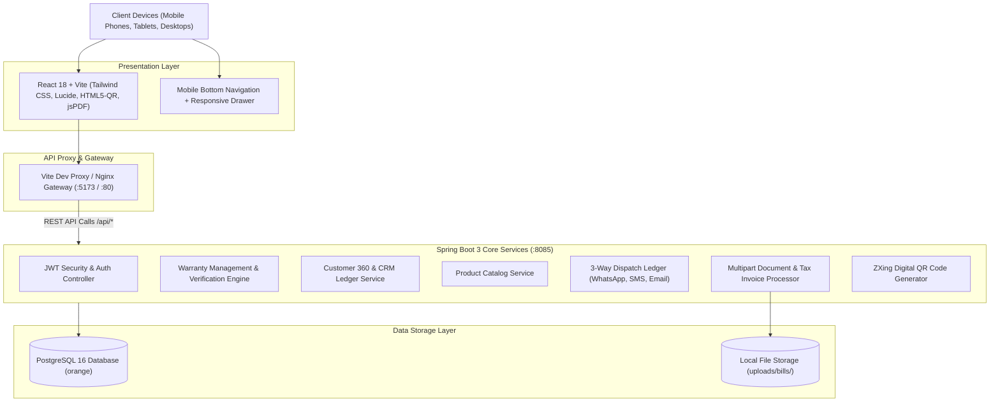
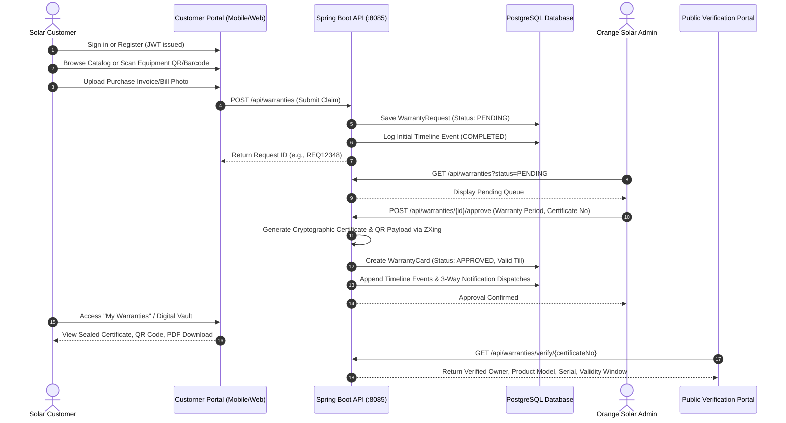

# Architecture & Technical Design Specification

## 1. System Overview

The **Orange Solar E-Warranty Generation & Verification System** is an enterprise-grade digital platform designed for **Sun Zone Solar System India Pvt. Ltd.** to streamline solar equipment warranty registrations, eliminate fraudulent claims, generate cryptographically signed warranty certificates, and provide transparent public verification and Customer 360 intelligence.

---

## 2. High-Level System Architecture



---

## 3. End-to-End Workflow & Transaction Lifecycle



---

## 4. Key Subsystems & Architectural Components

### 4.1. Authentication & Security Subsystem
- **Stateless JWT Tokens**: Issued via `/api/auth/login` and `/api/auth/register`, containing claims:
  - `id`: Customer or Admin ID
  - `sub`: Registered email address
  - `role`: `CUSTOMER` or `ADMIN`
  - `name`: User full name
- **Interceptors**: Frontend Axios automatically attaches `Authorization: Bearer <token>` to all protected outgoing requests.
- **Role-Based Authorization**:
  - `CUSTOMER`: Allowed access to product catalog, warranty submission, personal warranty vault, and profile settings.
  - `ADMIN`: Allowed access to control center, approval/rejection workflows, customer 360 database, and product management.
- **Cross-Origin Resource Sharing (CORS)**: Configured in `CorsConfig.java` to whitelist verified frontend origins with full HTTP method support (`GET`, `POST`, `PUT`, `DELETE`, `OPTIONS`).

### 4.2. Warranty Generation & Cryptographic Verification
- **Serial Tracking**: Unique serial prefix matching (e.g. `OS-ETC`, `OS-FPC`, `OS-RTG`) prevents cross-product claims.
- **ZXing QR Engine**: Embeds verification payload inside verifiable QR matrices:
  ```json
  {
    "certificateNo": "EW-2024-8841",
    "serialNumber": "OS-ULT-984210",
    "productName": "Diamond Glass Line Ultimate Solar Water Heater",
    "owner": "Ramesh Kumar",
    "validTill": "2029-08-30",
    "verifyUrl": "https://orangesolar.co.in/verify/EW-2024-8841"
  }
  ```
- **Public Trust**: Any smartphone camera or QR scanner can point at the physical/digital card and instantly verify validity through `/verify/{certificateNo}` without requiring an account login.

### 4.3. Customer 360 Intelligence & CRM Engine
- Aggregates purchases, equipment installed, live active warranties, pending claims, and lifetime financial investment in real time.
- Inline collapsible accordion ledger in admin portal enables 1-click inspection of customer identity, contact details, rooftop installation addresses, purchased units, and proof documents.

### 4.4. 3-Way Notification Dispatch Ledger
- Simulates and records multi-channel customer communications across:
  1. **WhatsApp**: Interactive messages with certificate link.
  2. **Email**: Branded notification with warranty terms.
  3. **SMS**: Immediate confirmation and tracking reference.

---

## 5. Technology Stack Summary

| Layer | Technology | Purpose |
|---|---|---|
| **Frontend Framework** | React 18 + Vite | High-performance SPA with instant HMR |
| **Styling & Fonts** | Tailwind CSS 3.4 + Google Fonts | Clean modern corporate UI (Plus Jakarta Sans + Inter) |
| **Icons & Media** | Lucide React | Unified vector icon set |
| **Barcode / QR** | HTML5-QRCode + ZXing | In-browser camera scanning and server-side QR generation |
| **PDF & Canvas** | jsPDF + html2canvas | Client-side official warranty certificate card export |
| **Backend Framework** | Spring Boot 3.3.4 (Java 17) | Enterprise REST API and transaction processing |
| **Persistence / ORM** | Spring Data JPA + Hibernate | Object-relational mapping and entity persistence |
| **Database** | PostgreSQL 16 | Relational ACID-compliant data storage |
| **Security & Auth** | JJWT (Java JWT) 0.12.6 | Cryptographically signed bearer token management |
| **Containerization** | Docker & Docker Compose | Container orchestration for DB, backend, and frontend |
