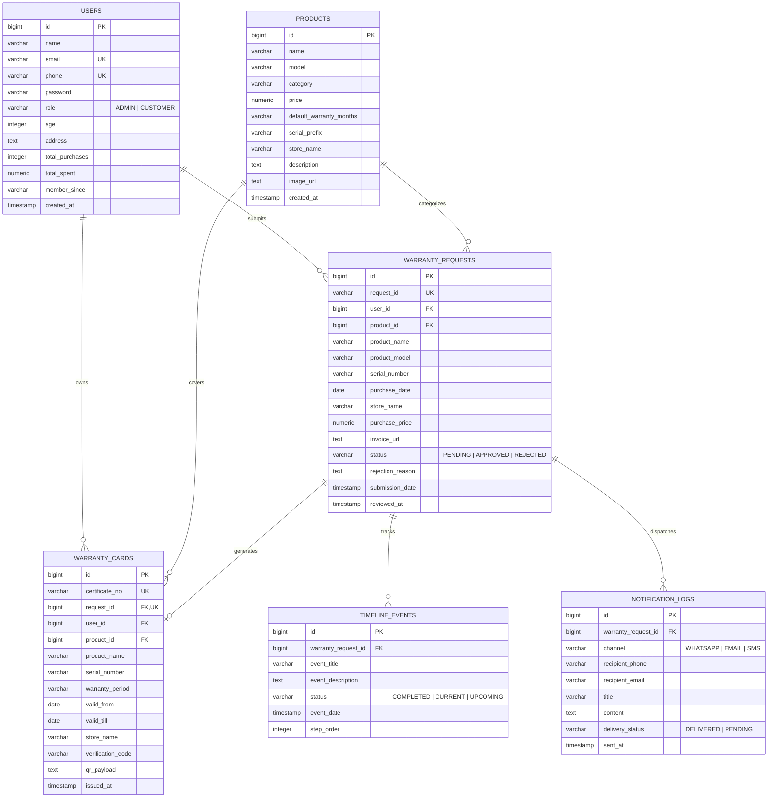

# Database Schema & Entity Specification

The Orange Solar E-Warranty System uses **PostgreSQL 16** as its primary relational database engine. Schema updates and table generation are managed via **Spring Data JPA / Hibernate** with `spring.jpa.hibernate.ddl-auto=update`.

---

## 1. Entity-Relationship Diagram (ERD)

---

## 2. Table Dictionaries

### 2.1. `users` Table
Stores authentication credentials, contact numbers, residential rooftop addresses, and cumulative CRM metrics.

| Column | Type | Constraints | Description |
|---|---|---|---|
| `id` | `BIGSERIAL` | `PRIMARY KEY` | Auto-incrementing unique user identifier |
| `name` | `VARCHAR(255)` | `NOT NULL` | Customer or administrator full name |
| `email` | `VARCHAR(255)` | `NOT NULL, UNIQUE` | Login email address |
| `phone` | `VARCHAR(255)` | `NOT NULL, UNIQUE` | 10-digit registered mobile phone number |
| `password` | `VARCHAR(255)` | `NOT NULL` | Account password |
| `role` | `VARCHAR(50)` | `NOT NULL` | `CUSTOMER` or `ADMIN` |
| `age` | `INTEGER` | `NULLABLE` | Demographics age |
| `address` | `TEXT` | `NULLABLE` | Full billing & installation address |
| `total_purchases` | `INTEGER` | `DEFAULT 0` | Total registered solar equipment units |
| `total_spent` | `NUMERIC(12,2)` | `DEFAULT 0.00` | Cumulative lifetime spend in ₹ |
| `member_since` | `VARCHAR(100)`| `NULLABLE` | Registration year / date tag |
| `created_at` | `TIMESTAMP` | `DEFAULT NOW()` | Account creation timestamp |

---

### 2.2. `products` Table
Master catalog of certified solar water heaters, panels, and equipment.

| Column | Type | Constraints | Description |
|---|---|---|---|
| `id` | `BIGSERIAL` | `PRIMARY KEY` | Product ID |
| `name` | `VARCHAR(255)` | `NOT NULL` | Brand equipment model name |
| `model` | `VARCHAR(100)` | `NULLABLE` | Manufacturer model code (e.g. `OS-ETC-ULT200`) |
| `category` | `VARCHAR(100)` | `NULLABLE` | Category (e.g. `Solar Water Heater (ETC)`) |
| `price` | `NUMERIC(10,2)` | `NULLABLE` | Suggested retail MRP in ₹ |
| `default_warranty_months`| `VARCHAR(20)` | `DEFAULT '84'` | Standard warranty duration in months (e.g. 7 years) |
| `serial_prefix` | `VARCHAR(50)` | `NULLABLE` | Equipment barcode serial prefix (e.g. `OS-ULT`) |
| `store_name` | `VARCHAR(255)` | `NULLABLE` | Authorized source / depot |
| `image_url` | `TEXT` | `NULLABLE` | High-res product photograph URL |

---

### 2.3. `warranty_requests` Table
Audit ledger of all incoming warranty registration claims.

| Column | Type | Constraints | Description |
|---|---|---|---|
| `id` | `BIGSERIAL` | `PRIMARY KEY` | Internal request sequence ID |
| `request_id` | `VARCHAR(50)` | `NOT NULL, UNIQUE` | Public tracking ID (e.g. `REQ12348`) |
| `user_id` | `BIGINT` | `FOREIGN KEY (users.id)` | Submitting customer |
| `product_id` | `BIGINT` | `FOREIGN KEY (products.id)` | Associated catalog equipment |
| `product_name` | `VARCHAR(255)` | `NOT NULL` | Product name recorded at submission |
| `product_model` | `VARCHAR(100)` | `NULLABLE` | Model code |
| `serial_number` | `VARCHAR(100)` | `NOT NULL` | Unique equipment hardware serial number |
| `purchase_date` | `DATE` | `NOT NULL` | Date purchased from retailer/dealer |
| `store_name` | `VARCHAR(255)` | `NULLABLE` | Retail store / authorized dealer name |
| `purchase_price`| `NUMERIC(10,2)` | `NULLABLE` | Invoiced purchase amount in ₹ |
| `invoice_url` | `TEXT` | `NULLABLE` | Uploaded bill / tax receipt document path |
| `status` | `VARCHAR(20)` | `DEFAULT 'PENDING'` | `PENDING`, `APPROVED`, or `REJECTED` |
| `rejection_reason` | `TEXT` | `NULLABLE` | Justification notes if claim was rejected |
| `submission_date` | `TIMESTAMP` | `DEFAULT NOW()` | Submission timestamp |
| `reviewed_at` | `TIMESTAMP` | `NULLABLE` | Admin verification timestamp |

---

### 2.4. `warranty_cards` Table
Official cryptographically issued e-warranty certificates.

| Column | Type | Constraints | Description |
|---|---|---|---|
| `id` | `BIGSERIAL` | `PRIMARY KEY` | Certificate record ID |
| `certificate_no` | `VARCHAR(100)` | `NOT NULL, UNIQUE` | Unique certificate ID (e.g. `EW-2024-8841`) |
| `request_id` | `BIGINT` | `FOREIGN KEY, UNIQUE` | Associated approved warranty request |
| `user_id` | `BIGINT` | `FOREIGN KEY` | Registered owner |
| `product_id` | `BIGINT` | `FOREIGN KEY` | Product ID |
| `serial_number` | `VARCHAR(100)` | `NOT NULL` | Equipment serial number |
| `warranty_period` | `VARCHAR(50)` | `DEFAULT '1 Year'` | Period of protection (e.g. `5 Years`) |
| `valid_from` | `DATE` | `NOT NULL` | Coverage start date |
| `valid_till` | `DATE` | `NOT NULL` | Official coverage expiration date |
| `verification_code` | `VARCHAR(100)` | `NULLABLE` | Security hash code |
| `qr_payload` | `TEXT` | `NULLABLE` | Encoded JSON matrix for QR scanners |
| `issued_at` | `TIMESTAMP` | `DEFAULT NOW()` | Issuance timestamp |
